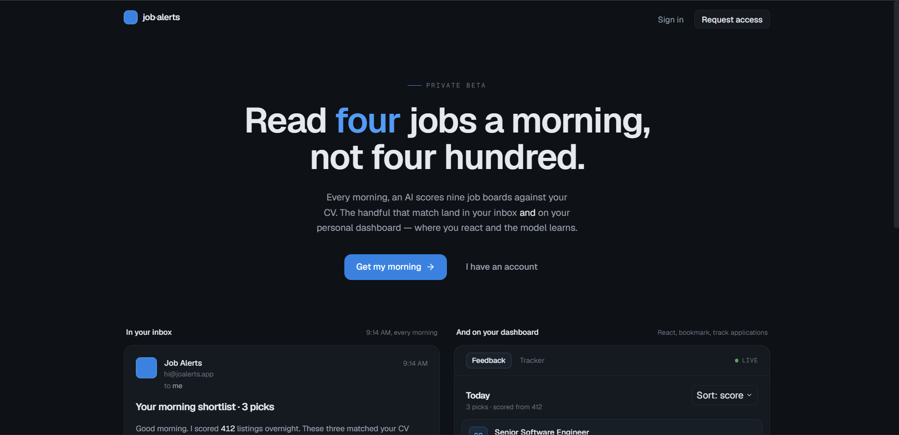

# Automated AI Job Intelligence System

A daily, fully-autonomous pipeline that scrapes the global remote job market, filters out the noise, scores each surviving role against a candidate's CV with a multi-LLM recruiter heuristic, and delivers a short, honest shortlist by email every morning. It runs for several people at once, learns from how each of them reacts, and costs nothing to operate.



*The front door people actually use, built in the companion [web-app repo](https://github.com/moe-the-goat/job-alerts-app). This repository is the engine behind it.*

The system is the answer to a specific problem: existing job aggregators assume geographic centrality and a default candidate profile. Their idea of "best fit for you" is calibrated for that profile. I built a sifter that injects explicit constraints into an unoptimized search market, replacing manual triage with a deterministic, observable, tested pipeline that runs on free infrastructure.

This repository is the engine: the scraping, filtering, scoring, learning, and email-sending worker. The website people actually sign up and log into is a separate Next.js app, and the two repos are meant to be read together. There is a link to the second one further down, at the point where the story crosses over into it.

This repository is what I built.

---

## The story behind it

I started this because I had hit a wall with manual job hunting. A typical evening went like this: an hour on LinkedIn, thirty tabs open, each posting read carefully, and at the end of it twenty-five of them needed US work authorization I do not have, three were senior roles hiding under a "junior" filter, one was an obvious scam, and the single remaining real job already had two thousand applicants. The signal-to-noise was brutal, and being wrong about any one posting cost a real hour of writing a tailored application for a role I could never legally take.

The thing that bothered me most was that this was not bad luck. The ranking on every aggregator assumes a default candidate, and I am not it: a Computer Engineering student based in Palestine. Every filter leaked in both directions. "Remote" kept US-only jobs that happened to say "remote" somewhere in the body. "Junior" hid global-remote jobs whose titles missed one narrow keyword. The tools were not built for someone like me, so they quietly wasted my time in proportion to how far outside the default I sat.

So I decided to build the sifter I wished existed. The first version was almost embarrassingly small: one script, JobSpy, a single email. Then reality arrived, one failure at a time. LinkedIn would return two hundred jobs one morning and zero the next, so I added redundant sources. Multi-year-old LinkedIn posts slipped into the email because I was decoding the post timestamp in seconds instead of milliseconds, a bug so silent it went unnoticed for weeks. The AI happily gave an obvious scam an eighty percent match because the keywords overlapped my CV, so I learned to never trust a model's headline number without a deterministic cap behind it. Each of these became a rule, then a test, then a line in this README.

Doing it alone was the hard part. There was no one to catch the silent bugs, no second pair of eyes on a regex, no teammate to argue me out of a bad abstraction. The discipline had to come from somewhere, so it came from the test suite: every bug that ever reached a real email is now frozen as a regression test named after it, so it can never come back. That habit is the reason a project this size, built by one person across many months, did not collapse under its own weight.

The last turn in the story is the one that splits this into two repositories. Once the tool worked for me, friends in the same job hunt wanted it. "Just fork it and configure your secrets" is not a real answer for someone who does not run cron jobs. So the single-user pipeline grew into a multi-tenant engine, and a real web app grew in front of it. That web app is its own repo, and the handoff to it is described below.

---

## Overview

Once an hour, a GitHub Actions workflow runs [multi_user_runner.py](multi_user_runner.py). It looks up every active, approved user whose next run is due, and for each one it reads their CV text and search preferences from a Supabase database, runs the full pipeline against them, writes the run summary and every scored job back to the database, and emails them a short shortlist. Each user is processed independently, on their own cadence, with their own learned preferences. Nothing runs unless the test suite passes first.

The pipeline talks to nine external job sources, six ATS platforms, three LLM providers (Cerebras and Groq for job verdicts, Gemini for the lower-ranked second pass and for embeddings), a search abstraction over Google Programmable Search and DuckDuckGo for occasional fact-checks, and Jina Reader as a fallback for careers pages no scraper can parse alone. It runs entirely on free tiers. The total monthly cost of operating it is zero.

A feedback loop closes the system end to end, and this is where the two repositories meet. Every daily email links to a personal feedback page, and each user also has a full dashboard, both served by the companion web app. When a user reacts to a job (applied, bookmarked, not for me, block company, wrong location), that reaction lands in the same database this worker reads. The worker embeds each reaction into a per-user RAG corpus, and a separate digest workflow compresses that history into a short preference profile that the verdict LLM reads on the next run. So tomorrow's picks reflect what each person actually applied to yesterday.

Inside this repo there are seventeen modules under [pipeline/](pipeline/), three thin orchestrators at the repo root, a curated reputation list, **724 tests across 52 files**, and four GitHub Actions workflows that wire the whole thing into a self-managing loop. The rest of this document is a tour of why each piece is shaped the way it is.

---

## The problem it solves

I started this project because I had reached a frustrating equilibrium with manual job hunting, described in the story above. The short version: existing aggregators rank for a default candidate, and when you sit outside that profile their filters leak in both directions, keeping the jobs you cannot take and hiding the ones you can.

The system in this repository inverts that. It assumes nothing about the candidate except what the CV says, and forces every other piece of information (location, company reputation, scam probability, work-authorization restrictions, seniority level) to be inferred explicitly, with traceable rules, before a job is allowed near anyone's inbox.

And because it inverts the ranking per candidate rather than once globally, the same engine works for a group of people with very different CVs at the same time. One person's noise is another person's match. The pipeline does not hardcode my preferences; it reads each user's CV and history and scores the same market differently for each of them.

---

## How it works

At the highest level, the pipeline is a six-stage funnel that closes back on itself through the feedback loop. The runner applies this funnel once per due user, per run:

```
   raw scrape (global APIs + JobSpy + Palestinian local sources)
          |
          v
   deterministic filter gauntlet
   (incl. geo-lock pattern matching ~80 countries
    on description AND location fields)
          |
          v
   embedding pre-rank with region, trust, and role-tier weighting
   (per-user: ranked against THAT user's CV)
          |
          v
   top-section AI evaluation (Cerebras + Groq, top 55 + 5 wildcards)
   with the user's learned preferences injected into the prompt
          |
          v
   lower-ranked AI evaluation (Gemini Flash Lite, next ~25 jobs)
          |
          v
   persist to database + email the user + feedback link
          |
          v
   user reacts (web app) -> embeddings -> next run's prompt
```

Each stage exists for a reason and was added in response to a specific failure mode I observed in production. The funnel is sequential and largely deterministic until the AI step, which is the only place a black-box model gets a voice, and even there the verdicts are post-processed by deterministic caps before they reach the user.

**Stage 1 — Raw scrape.** Nine external sources, each behind its own fetcher. JobSpy hits LinkedIn and Indeed across region-specific queries. Six public APIs supplement it (Remotive, Arbeitnow, Jobicy, RemoteOK, Himalayas, The Muse, WeWorkRemotely via RSS). YC's Work at a Startup is pulled via Jina Reader plus Gemini extraction. A separate local-sources collector handles the Palestinian market, which most aggregators ignore entirely: a four-mode search per company combining ATS lookups, handle-precise search-engine queries against LinkedIn posts, domain-restricted website queries, and a JobSpy fallback, plus public Telegram channels and the jobs.ps board. The local market is identical for every user, so it is scraped once per tick and shared, then re-ranked per user.

**Stage 2 — Filter gauntlet.** Eight deterministic checks: seen-jobs cache, reputation prefilter, dedup, language detection, location prefilter, seniority filter (including FAANG-style level codes), tech-keyword whitelist, and a non-tech intern blocker. A typical run filters hundreds of raw jobs down to a few dozen survivors before any AI is involved.

**Stage 3 — Embedding pre-rank.** Survivors are embedded against the user's CV, then sorted by `weighted_score = cosine_similarity * region_weight * trust_weight`. The weights inject the inductive bias the embedding model lacks: fully-remote and Middle East roles get 1.30x, EU and Americas roles get 1.15x, India gets 0.70x, sanctioned regions get 0.50x. Trusted companies stack a 1.25x multiplier. Because the CV differs per user, the ranking differs per user.

**Stage 4 — Top-section AI evaluation.** Top 55 plus 5 wildcards reach a heuristic pre-screen, then the verdict LLM. Cerebras is the primary and Groq is the ping-pong fallback. The model returns a structured verdict with sub-scores, an opinionated recruiter-voice text verdict, and a `suspicious` flag. Each user's learned preference profile (built from their own feedback) is injected into the prompt so the model scores with their history in mind. Deterministic caps post-process the result before it reaches the user.

**Stage 5 — Lower-ranked AI evaluation.** The next 25 jobs by weighted similarity are passed through a cheaper second-pass verdict on Gemini Flash Lite. Same prompt, same post-processing, no web fact-check and no scam check (those are reserved for the top section where the budget exists). The result is rendered under a compact "Also Found" table so the long tail is visible without burning Cerebras quota.

**Stage 6 — Persist and deliver.** Every scored job and a run summary are written to the database the web app reads. The email is rendered with color-coded match badges, bolded `MATCH:` / `REMOTE:` / `GAP:` / `CLOSING-REASON:` markers, severity badges on titles, and the lower-ranked table at the bottom. It is sent over Gmail SMTP, which delivers to any recipient with no custom domain required. The email carries a private, tokenized link to that run's feedback page on the web app.

**Stage 7 — Feedback loop.** Reactions captured in the web app land in the shared database. The worker embeds each one into a per-user RAG corpus, and a separate digest workflow on its own cron compresses that history into a fresh candidate preference profile per user. The next run injects that profile into every verdict prompt, so the AI scores future jobs with each person's actual history in mind, not just their CV.

That is the system, end to end. The next section is the deep tour.

---

## The pipeline in detail

<details>
<summary><strong>Search — the nine sources</strong></summary>

The first version of this project used only JobSpy. It was unreliable: LinkedIn's anti-bot detection produced anywhere between two hundred jobs and zero jobs on consecutive runs, and the source was opaque about why. The fix was redundancy. I added Remotive, Arbeitnow, Jobicy, and RemoteOK first because each exposes a clean public REST API with no authentication required and has been stable across the entire history of this project. Then came Himalayas, The Muse, and WeWorkRemotely (RSS, parsed via `feedparser`). Each source has its own fetcher in [pipeline/core_search.py](pipeline/core_search.py), each returning a `pandas.DataFrame` with a normalized schema of `title, company, location, job_url, description, date_posted`. Every fetcher is wrapped in a try/except so a single dead vendor cannot stop the pipeline.

Recency is handled per-source because the APIs differ. JobSpy filters server-side with `hours_old=24`. The public APIs do not support server-side recency filtering, so [filter_api_jobs](pipeline/core_filter.py) does a client-side date filter at `hours_old=72` to give more headroom. Arbeitnow returns Unix timestamps; everyone else returns ISO strings; the filter handles both.

For the local market the search story is different, and it lives in [pipeline/core_local_sources.py](pipeline/core_local_sources.py). Most Palestinian companies do not post jobs on standard aggregators at all. They hire through LinkedIn posts (not the Jobs section), private referrals, or custom careers pages with no SEO. So the local collector reads the IT-company list from two Excel sheets, extracts each company's LinkedIn handle, and runs several search modes per company: a handle-precise query against `linkedin.com/company/{handle}/posts`, a domain-restricted query against the website, a JobSpy fallback, and a direct ATS lookup. Each LinkedIn post URL has its publication date decoded from the embedded snowflake activity ID, a tiny piece of LinkedIn's internal data model that proves whether the post is fresh or whether a search engine cached it from 2017. This decoder once treated the timestamp as seconds instead of milliseconds, which made it always fail silently and let multi-year-old posts slip into emails for weeks. The fix is the single line `datetime.fromtimestamp(ts_milliseconds / 1000, tz=timezone.utc)`, and catching it is one of the things I am proudest of, because the failure mode was completely invisible.

A later addition to the local path: ATS APIs return every open posting a company has, including ones the company forgot to close, and a stale listing still answers a live HTTP 200 so the dead-URL probe cannot catch it. So local ATS jobs are now also aged out by their posted date, and companies whose only listed website is a LinkedIn URL (no real careers page) are skipped entirely instead of generating search noise that never yields a usable job.

</details>

<details>
<summary><strong>Filter — the gauntlet</strong></summary>

The deterministic filter chain is the cheapest part of the pipeline and does the most work. Each step exists because something specific went wrong without it.

1. **Seen-jobs**. URLs evaluated yesterday do not need to be evaluated again. The tracker is a per-user set; in the multi-user world it lives in the database so a job scored for one user is not re-scored for that same user on the next tick.

2. **Reputation prefilter**. Some companies are reliably terrible, the cluster that has produced exactly zero legitimate offers. [data/reputation.json](data/reputation.json) holds a curated list of name and handle patterns. Matches are tagged `pre_flagged_low_quality` and get a match cap downstream. Trusted companies (84 of them, including Anthropic, GitLab, Stripe, Cohere, Spotify, Klarna) carry the inverse flag.

3. **Smart deduplication**. URL dedup catches the easy case. Normalized title-plus-company dedup catches the case where the same role is posted as "Software Engineer (Remote)" and "Software Engineer" by the same company; they look distinct via URL but are the same job.

4. **Language**. CJK characters in the title kill the row immediately. For everything else, `langdetect` runs on the title (with a 30-character minimum to avoid false positives on short tech titles loaded with proper nouns) and on the description (with a 100-character minimum, lowered from 300 after observing non-English descriptions leaking through on short bilingual postings).

5. **Location**. Explicit location-locked postings that do not say "remote" in the title or location are dropped.

6. **Seniority**. The obvious words: senior, principal, staff, manager, director, VP, lead, head, president, architect. Plus FAANG-style internal level codes (Netflix L4-L12, Meta IC4-IC12, Stripe E4-E9, Amazon SDE II-9, Google G7-G12). Level codes were added after a Netflix posting titled "Software Engineer (L5)" made it into an email and reminded me that L5 is not entry-level work no matter how clean the title looks.

7. **Tech keyword whitelist**. The title must contain at least one of about thirty tech signals.

8. **Non-tech intern blocker**. The catch-all `intern` keyword above lets through "Graduate Research Intern, Biology" and "Business Analyst Intern", both of which I observed in real emails. This final step drops any title containing `intern` alongside a non-tech signal (biology, business analyst, social media, HR, finance, legal, and others).

After this chain, a typical run has filtered hundreds of raw jobs down to a few dozen survivors. The AI never sees the rest.

</details>

<details>
<summary><strong>Embedding — the ranker</strong></summary>

Pre-ranking via embedding similarity has two purposes. The first is quota management: free embedding tiers are bounded, and one full AI verdict costs a request plus throttle time, so with dozens of survivors per user we cannot afford to evaluate everyone. The second is more interesting: the embedding ranker is where inductive bias the AI cannot see gets injected. The AI sees one job at a time and scores it on the merits. The ranker sees all of a user's jobs at once and answers the cross-cutting question: of these, which are most worth burning limited AI budget on?

The CV is embedded once per run (cached by hash so it only regenerates when the CV changes) and each job is embedded as `title + description` truncated to a few thousand characters. The character limit started at 1000; I raised it after noticing that most descriptions open with two or three paragraphs of HR boilerplate before the actual requirements, so a short cutoff was teaching the embedding the company's marketing voice instead of the role.

Then the inductive bias. [pipeline/region_weighting.py](pipeline/region_weighting.py) classifies every job into a five-tier region category based on location signals across title, company, and description:

| Tier | Multiplier | Examples |
| --- | --- | --- |
| Highly preferred | 1.30x | Worldwide / Anywhere / Fully Remote, Middle East, Africa |
| Preferred | 1.15x | EU (15+ countries), LATAM, Canada, non-India South Asia |
| Neutral | 1.00x | US, unspecified |
| Deweighted | 0.70x | India / Pvt Ltd / Indian metros |
| Heavily deweighted | 0.50x | Sanctioned regions (Russia, China, Iran, North Korea, Belarus) |

A second multiplier (1.25x) stacks for the trusted companies in [data/reputation.json](data/reputation.json). The final `weighted_score` drives the ranking; the raw `similarity` is preserved for visibility. The result: a 0.57 raw-similarity "Junior Software Engineer, Remote, Brazil" sorts well above a 0.57 raw-similarity Indian sus-internship, because Brazil's 1.15x beats India's 0.70x.

Top 55 jobs by weighted score plus 5 deterministically-sampled wildcards reach the AI. The rest appear in the email under a lower-ranked section with their similarity scores but no full AI verdict, a hedge against the ranker being wrong about something the AI would have caught.

</details>

<details>
<summary><strong>AI — the verdict LLM (Cerebras + Groq)</strong></summary>

Job verdicts are generated by **Cerebras** (primary) with **Groq `llama-3.3-70b-versatile`** as a hot fallback, both free-tier instruction-tuned models that produce clean JSON without burning tokens on internal reasoning. The fallback logic in [pipeline/core_llm.py](pipeline/core_llm.py) alternates providers in a ping-pong pattern (Cerebras, Groq, Cerebras, Groq) with at least four attempts and a short inter-attempt pause before giving up on a job. Transient 5xx / rate-limit / timeout errors are retried; 4xx auth errors still trigger a provider switch in case the failure is model-specific rather than credential-specific.

Why not Gemini for verdicts? Gemini's free tier caps at 500 requests per day. After the embedding pre-rank also uses Gemini, dedicating the remaining quota to embeddings and the lower-ranked second pass rather than top-section verdicts produces better signal for zero additional cost.

A critical lesson from the provider search: **avoid reasoning models**. The "thinking" variants consume the entire completion-token budget on hidden internal chain-of-thought before emitting visible text, leaving the actual JSON empty or truncated. The `instruct` suffix in a model name is the reliable indicator of a non-thinking variant.

The prompt is engineered to make the model think like a senior recruiter, not a friendly career-coach AI. It is forbidden from using the word "strong" or any generic praise. Every match claim must cite a specific CV asset by name, and every gap claim must name the missing requirement specifically. The verdict structure is anchored: `MATCH:`, optionally `SECOND MATCH/GAP:`, then `GAP:`, optionally `CLOSING REASON:` when the model decides to disqualify outright. It also demands explicit math: `match_percentage = 0.5 * tech_fit + 0.3 * experience_fit + 0.2 * logistics_fit`, capped when suspicious. That makes the verdict auditable. When the math does not add up, I know the model lied about its sub-scores.

Two failure modes shaped the post-processing. First, when a description is missing or truncated by LinkedIn's authwall, the model used to invent confidence it did not have; a "Limited Info Protocol" paragraph in the prompt fixed it by telling the model to deduct from each sub-score and note the missing description. Second, the model sometimes flagged a posting as suspicious and then gave it 80% anyway. [apply_post_ai_caps](pipeline/core_ai.py) is the deterministic guard: any self-flagged suspicious result above the cap gets clamped and the verdict gets an `[AI-SUSPICIOUS]` prefix. For India-located suspicious companies, a third layer runs short web queries against the company name and drops the match with a `[SCAM]` tag when multiple scam signals appear, tuned conservatively so it never punishes a legitimate company.

</details>

<details>
<summary><strong>Lower-ranked second pass — Gemini Flash Lite verdicts</strong></summary>

After Cerebras and Groq finish scoring the top section, the next jobs by weighted similarity go through a cheaper second pass on **Gemini Flash Lite**. The prompt is identical and the post-processing (suspicious cap, blacklist cap, schema normalization) is unchanged, so the lower-ranked rows are first-class citizens in the email rather than a similarity-only listing.

Two cost-saving differences shape the second pass. The web fact-check is skipped (the top-section budget is reserved for jobs the ranker already thinks are best). The open-web scam check is skipped (the reputation blacklist upstream handles known offenders). The resulting jobs render under a compact "Also Found" table at the bottom of the email, with anything suspicious or blacklisted stripped out so the section never amplifies spam.

</details>

<details>
<summary><strong>Feedback loop — closing the system end to end</strong></summary>

The system used to be one-directional: the pipeline guessed at what a good job looked like, sent the email, and waited. The feedback loop closes the gap, and it is the seam where this repo meets the web app.

When a user reacts to a job, the reaction is written to the shared Supabase database by the web app. This worker reads it. Hard signals apply immediately (a `block_company` reaction caps that company's future scores). Every reaction is embedded into a per-user RAG corpus via [pipeline/core_feedback_supabase.py](pipeline/core_feedback_supabase.py), which stores Gemini embedding vectors in a pgvector table for per-user similarity search.

Soft signals feed the prompt rather than acting immediately. A separate workflow, [.github/workflows/multi_user_digest.yml](.github/workflows/multi_user_digest.yml), runs [feedback_digest_multi_user.py](feedback_digest_multi_user.py) on its own cron. For each user it compresses their reaction history into a short preference profile (using the same Cerebras-with-Groq-fallback summarizer, with the shared prompt living in [pipeline/core_feedback.py](pipeline/core_feedback.py)) and stores it. Every pipeline run loads that profile and injects it into the verdict prompt as a learned-preferences block alongside the CV facts, so the AI scores future jobs with each person's actual history in mind.

</details>

<details>
<summary><strong>ATS — direct integration</strong></summary>

A late but important discovery: most companies do not write their own careers pages. They use a SaaS hiring platform (Greenhouse, Lever, Workable, Ashby, Workday, FactorialHR) and each of these has a free public JSON API that returns current openings without authentication. Scraping the HTML careers page is brittle and triggers anti-bot; hitting the structured API is clean and gives live data that, by construction, contains only currently-open positions.

[pipeline/core_ats.py](pipeline/core_ats.py) implements six platforms. For each, the URL pattern is detected once via a regex against the careers-page HTML, the result is cached for thirty days, and subsequent runs hit the platform's API directly. Greenhouse uses `?content=true`, which inlines descriptions in the same call. Workday is the most complex: its endpoint requires a composite `tenant|cluster|site` token packed from a regex against URLs like `nvidia.wd5.myworkdayjobs.com/en-US/NVIDIAExternalCareerSite`. FactorialHR was added specifically after a ghost listing from one Palestinian company's indexed page kept appearing in emails for weeks; integrating their public API meant we only ever see roles that are actually open today.

For companies that use none of these platforms (a real condition for many small EU and Palestinian businesses), a tiered fallback runs: first BeautifulSoup extracts visible text from the already-fetched careers HTML; if that yields too little (meaning the page is a JavaScript-rendered SPA whose body is empty), Jina Reader renders the page to markdown; whatever text we have is sent to Gemini with an extraction prompt that produces a structured job list. The fast, free Tier 1 handles the common case, and the slower Tier 2 only fires for genuinely SPA pages.

</details>

<details>
<summary><strong>URL validation — defending against blog posts and ghost listings</strong></summary>

[pipeline/url_validation.py](pipeline/url_validation.py) does two things, both in response to specific failure modes observed in real emails.

**Path-pattern check.** A pure-Python `is_job_url_like(url)` rejects search results whose paths do not look like job pages. It requires positive signals (`/job/`, `/careers/`, `/positions/`, `/apply/`) AND zero negative signals (`/blog/`, `/news/`, `/article/`, year segments like `/2017/`). This single rule killed a class of failure where blog posts were treated as jobs, including a real case where a market-update article matched a "logistics" keyword search.

**HEAD-probe ghost-listing filter.** A concurrent batch probe (ten worker threads, five-second timeout each) checks every search-discovered URL for 404, 410, or 451 status codes, and for redirects to known "no longer available" sink URLs. It catches ghost listings companies removed but search engines still index. It runs once per batch after collection, not per row.

</details>

<details>
<summary><strong>Notify — the polish</strong></summary>

The email is the final product, and how it looks matters more than I expected when I started. The first version was a plain text dump and it was unreadable: I would scan it for thirty seconds, see nothing obviously good, and close it. The current version is HTML, with color-coded match badges (green for high, amber for medium, red for low, grey for unknown), bolded `MATCH:` / `GAP:` / `CLOSING-REASON:` keywords inside each verdict, sub-score breakdowns under each headline percentage, severity badges on titles in decreasing order (web-confirmed scam, reputation blacklist, AI-flagged suspicious), an inline color legend at the top, and a compact lower-ranked table for the long tail.

Delivery is over Gmail SMTP ([pipeline/core_email_smtp.py](pipeline/core_email_smtp.py)). An earlier version used a transactional-email provider that, on its free tier, would only deliver to the account owner and otherwise required a paid verified domain. Moving to Gmail SMTP removed that blocker entirely: it sends to any recipient, needs no domain, and reuses the same credentials across the worker and the web app. The send never raises into the run loop, so one user's email failure cannot take down everyone else's run.

</details>

---

## Design decisions that mattered

<details>
<summary><strong>Two-tier evaluation: heuristic pre-screen before the LLM</strong></summary>

The heuristic pre-screen in `quick_viability_check` saves roughly a third of AI calls. It runs gates in sequence: reputation blacklist, non-tech title signal, description-length sanity check (with bypasses for legitimate cases like radar snippets and authwall placeholders), explicit senior-experience requirement, a hard work-authorization disqualifier, and a generalized geo-lock pattern check covering explicit restrictions for 80+ countries and regions. The geo-lock gate compiles phrase templates at startup ("must reside in {country}", "{country} residents only", "legally authorized to work in {country}") against a list that includes every major employment market. Cost of the heuristic: microseconds per job. Cost of the AI call it replaces: multiple seconds plus one quota slot. The asymmetry justified the work.

</details>

<details>
<summary><strong>Region and trust weighting: where the inductive bias lives</strong></summary>

The single biggest quality lever in the pipeline. Without it, a 0.85 raw-similarity "Backend Intern, Bangalore" outranks a 0.55 raw-similarity "Junior Engineer, Egypt" even though the Egypt job is actually actionable and the Bangalore one is not. With multiplicative weights (region tier from 0.50 to 1.30, trust boost 1.25x), the order inverts. The weights are tuned conservatively so India is down-weighted, not banned; a genuinely strong Indian job with no suspicion flags can still surface, it just has to clear a higher bar.

</details>

<details>
<summary><strong>Self-cap on AI-flagged suspicious verdicts</strong></summary>

The AI sometimes flags a job as suspicious AND gives it a high match because the tech keywords overlap the CV. [apply_post_ai_caps](pipeline/core_ai.py) is the deterministic clamp: any self-flagged suspicious result above the cap gets clamped, and the verdict gets an `[AI-SUSPICIOUS]` prefix that makes the flag visible. Keeping the model's sub-score breakdown faithful while letting deterministic policy adjust the headline number is a pattern I would apply to any LLM-in-the-loop system.

</details>

<details>
<summary><strong>Mark-on-success seen-jobs semantics</strong></summary>

The tracker only marks a URL as seen when the AI returns a real verdict. If a call fails with a quota error or a 5xx, the URL stays unmarked so it can be retried next time. The original implementation marked seen unconditionally, which meant a single bad afternoon at a provider's data center would silently lose a run's worth of jobs forever. The behavior is encoded in the second return value of `evaluate_job_with_ai`: a tuple of `(result_dict, evaluated_bool)`, where the caller only marks seen when `evaluated_bool` is true.

</details>

<details>
<summary><strong>One shared pipeline package, thin per-mode entry points</strong></summary>

The worker is one importable package under [pipeline/](pipeline/) with thin orchestrators at the root. When the project went multi-user, the new runner did not fork the pipeline; it reused the same modules and looped over users from the database. During a later cleanup the few helpers that the multi-user path was quietly borrowing from the old single-user scripts were lifted into the package proper, so the engine no longer depends on any legacy entry point. Separating reusable policy from invocation is the habit that made the single-to-multi transition a matter of writing one new orchestrator rather than rewriting the system.

</details>

<details>
<summary><strong>Secrets isolation and per-user data boundaries</strong></summary>

The worker authenticates to the database with a service-role key held only as a GitHub Actions secret, never in the repo. Email credentials are secrets too, masked in logs automatically. Every read and write is scoped to a specific user id, and the database enforces row-level isolation on top of that. The reputation list at [data/reputation.json](data/reputation.json) is curated data, not code; editing it does not require a code review, just a passing test suite, and the QA gate ensures even that lightweight workflow cannot ship a broken JSON file by accident.

</details>

---

## Engineering discipline

Everything above describes what the system does. This section describes how I made sure it keeps working, and is the part of the project I would point a hiring manager toward first.

**724 tests across three tiers.** The suite in [QA/](QA/) follows the testing pyramid. Most tests are unit tests in `QA/unit/` (pure functions, deterministic, sub-millisecond). Some are integration tests in `QA/integration/` (multi-module flows with external services mocked). The rest are regression tests in `QA/regression/`. The test runner at [QA/run_all.py](QA/run_all.py) is pure stdlib, so no pytest dependency is required to run it, though every test is pytest-compatible too. The whole suite executes in roughly twenty-four seconds locally.

**Regression tests named for production bugs.** Each file in `QA/regression/` freezes a specific failure that once made it into a real email. The millisecond date-decoder bug, the logs-repo URL normalization, the short-description bypass, the zero-similarity render. When something breaks in production, the fix is not complete until there is a regression test pinning it. This is the discipline that turns code into something you can maintain rather than something you have to babysit, and building solo, it is the closest thing I had to a second pair of eyes.

**Two CI gates.** [.github/workflows/qa.yml](.github/workflows/qa.yml) runs on every push and pull request; if the suite fails, the diff does not reach `main`. Separately, the [multi_user.yml](.github/workflows/multi_user.yml) cron runs the suite again before the worker starts. This is defense in depth: a regression that slips through review, or a non-code change like a `data/reputation.json` edit or a dependency resolver picking up a breaking update overnight, still gets caught before the system dispatches a garbage email.

**Structured logging across every module.** [pipeline/logging_setup.py](pipeline/logging_setup.py) replaces every `print()` with a properly-leveled logger call. The format (`HH:MM:SS LEVEL module: message`) is scannable in the Actions console. Progress is INFO, recoverable failures (retries, missing keys, fetch errors) are WARNING, dispatched failures (AI exhausted, email failures) are ERROR. Chatty third-party libraries are silenced to WARNING regardless of the root level. `configure_logging()` is idempotent and respects a `LOG_LEVEL` override.

---

## Where this connects to the web app

This repository is the engine. The thing people actually use, the website where they sign up, upload a CV, set their searches, read their picks on a dashboard, react to jobs, and track applications, is a separate Next.js app deployed on Vercel.

The two share one Supabase database. This worker reads users, CVs, and preferences from it, and writes runs, scored jobs, and embeddings back. The web app owns everything a human touches: signup and the closed-beta access gate, onboarding, the dashboard with its feedback and tracker tabs, and the per-run feedback page linked from every email. The feedback a user gives in the web app is exactly the feedback this worker reads on the next run.

If you want to see the other half of the system, how multi-tenancy is enforced at the database and application layers, how the access gate and the one-time-code account flow work, and how the dashboard is built, continue here:

**→ [Job Alerts — Web App](https://github.com/moe-the-goat/job-alerts-app)**

The two READMEs are written to complete each other. This one is the engine; that one is the front door.

---

## Project layout

<details>
<summary>Click to expand the directory tree</summary>

```
.
|-- pipeline/                         core modules, each a single responsibility
|   |-- core_search.py                fetchers for the global external sources
|   |-- core_local_sources.py         Palestinian local market (ATS + search + Telegram + jobs.ps)
|   |-- core_ats.py                   six ATS integrations + tiered Jina fallback
|   |-- core_websearch.py             Google Programmable Search + DuckDuckGo fallback
|   |-- core_filter.py                deterministic filter gauntlet + JobTracker
|   |-- core_embedding.py             CV-similarity pre-ranker (Gemini embeddings)
|   |-- core_llm.py                   Cerebras + Groq ping-pong fallback verdict client
|   |-- core_ai.py                    verdict prompt, pre-screen, scam check, post-AI caps
|   |-- core_feedback.py              feedback constants, RAG threshold, shared digest prompt
|   |-- core_feedback_supabase.py     per-user feedback corpus + embeddings for RAG
|   |-- core_supabase.py              service-role client + per-user job/run persistence
|   |-- core_email_smtp.py            Gmail SMTP transport (sends to any recipient)
|   |-- core_notify.py                email HTML rendering
|   |-- region_weighting.py           geographic + trust + role-tier weighting for the ranker
|   |-- url_validation.py             URL-pattern check + HEAD probe for ghost listings
|   `-- logging_setup.py              configure_logging + get_logger helpers
|
|-- multi_user_runner.py              multi-tenant pipeline entry point (hourly cron, per-user due check)
|-- feedback_digest_multi_user.py     per-user preference-profile summarizer
|-- cleanup_retention.py              weekly retention cleanup of old rows + tokens
|
|-- data/
|   `-- reputation.json               curated blacklist + trust-boost list
|
|-- IT Companies - Nablus.xlsx        target list (Palestinian local pipeline)
|-- IT Companies - Ramallah.xlsx      target list (Palestinian local pipeline)
|
|-- QA/
|   |-- unit/                         pure-function tests (most of the suite)
|   |-- integration/                  multi-module flow tests with mocks
|   |-- regression/                   each file pins a specific shipped bug
|   |-- fixtures/                     shared test data
|   |-- conftest.py                   pytest path setup
|   `-- run_all.py                    stdlib-only test runner
|
|-- requirements.txt                  runtime deps
|-- requirements-qa.txt               test-only deps (pytest)
|
`-- .github/workflows/
    |-- qa.yml                        runs QA on every push/PR
    |-- multi_user.yml                multi-user pipeline (hourly cron)
    |-- multi_user_digest.yml         per-user feedback summarization
    `-- cleanup_retention.yml         weekly retention cleanup
```

</details>

---

## Running it locally

```bash
# Install runtime + test deps
pip install -r requirements.txt
pip install -r requirements-qa.txt

# Set the required secrets
export GEMINI_API_KEY=...                         # embeddings + lower-ranked Gemini verdicts
export GEMINI_EMBED_API_KEY=...                   # optional dedicated embedding key (recommended)
export CEREBRAS_API_KEY=...                       # primary verdict LLM (Cerebras free tier)
export GROQ_API_KEY=...                           # fallback verdict LLM (Groq free tier)
export SENDER_EMAIL=...                            # Gmail address that sends the alerts
export EMAIL_APP_PASSWORD=...                     # Gmail app password, not your account password
export SUPABASE_URL=...                            # Supabase project URL (per-user data + runs)
export SUPABASE_SERVICE_ROLE_KEY=...              # Supabase service-role / secret key (server-only)
export APP_BASE_URL=https://<your-app>.vercel.app  # web app base, for the email feedback link

# Run the test suite (must pass before the pipeline runs)
python QA/run_all.py

# Run the multi-user pipeline (processes each due, whitelisted user)
python multi_user_runner.py

# Useful flags: --dry-run (no email/writes), --skip-due-check, --user-id <uuid> --manual
```

The runner is safe to run repeatedly. The seen-jobs tracker prevents duplicate AI evaluations, and a per-user due check means a manual run will not double-charge a user against their daily run budget unless you force it.

---

## Numbers

A snapshot of the current state:

| Metric                                      | Value                                            |
| ------------------------------------------- | ------------------------------------------------ |
| External global job sources integrated      | 9                                                |
| ATS platforms with direct API integration   | 6                                                |
| Region tiers in the weighting system        | 5                                                |
| Companies in the trust-boost list           | 84                                               |
| Companies in the reputation blacklist       | 12                                               |
| Geo-lock countries covered (pre-screen)     | 80+                                              |
| Total tests in the QA suite                 | 724                                              |
| Test files                                  | 52                                               |
| QA suite runtime (local, sequential)        | ~24 seconds                                      |
| Verdict LLM (primary, top section)          | Cerebras (free tier)                             |
| Verdict LLM (fallback, top section)         | Groq llama-3.3-70b-versatile (free)              |
| Verdict LLM (lower-ranked second pass)      | Gemini Flash Lite                                |
| Embedding model                             | Gemini embeddings (dedicated key, free tier)     |
| AI evaluation top-N                         | 55 + 5 wildcards                                 |
| Lower-ranked second-pass cap                | 25 jobs                                          |
| Email transport                             | Gmail SMTP (any recipient, no domain)            |
| Worker schedule                             | hourly cron, per-user due check                  |
| Monthly cost                                | $0                                               |

---

## A personal note

This project is, in its own small way, evidence of an engineering temperament: when an existing tool wastes time in proportion to a structural gap, the productive response is to build a better tool. The choice was to spend hours every week sifting through low-signal job feeds, or to spend a few months building a sifter that does it deterministically, testably, and for free, then turn it into something other people could use too. I chose the latter, and the result is split across this repo and the web app.

Building it alone meant every silent bug was mine to find, every architecture call was mine to second-guess, and every late obstacle (a stale ATS listing, a search engine serving captchas, an email provider that quietly refused arbitrary recipients) was a wall I had to get over by myself before the next person could use the thing. The test suite was my safety net, the regression files are the scars, and the fact that it now runs every morning for more than just me is the part I am proudest of.

If you are an engineer reading this and want to understand how the pipeline works, every module is documented inline and every shipped bug has a regression test pinning it down. If you are a recruiter or hiring manager looking for evidence of how I think about architecture, trade-offs, quality, and maintaining production software, this repository, together with its [web-app companion](https://github.com/moe-the-goat/job-alerts-app), is the most honest portfolio I can offer.

Thank you for reading.
